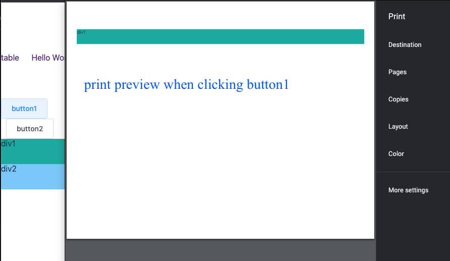

# elements-printer

Using the Elements printer, you can print one or more specified elements on a webpage.


## install

```bash
$ npm install elements-printer --save
```

## usage

import the css file. You can use the referencing method in your project to reference this file. 

```js
import 'elements-printer/index.css';
```

To print a particular element on a webpage, simply give it a class name of "print-element" and then invoke the `window.print()`method.

```html
<div id="div1">div1</div>
<div id="div2" class="print-element">div2</div>
```

The following is a print preview of the code snippet shown above.


If you also add a class name of "print-element" to div1, both div1 and div2 will be printed.


### Use a custom selector

It doesn't have to be a class name; any valid selector supported by the document.querySelectorAll method is supported. 

If you have two elements to print and want to print div1 by clicking button1 and div2 by clicking button2, you cannot use the default class name **print-element**. You need to use a custom class name and import a JavaScript file.

```js
import 'elements-printer';
```

You have the following DOM

```html
<button>button1</button>
<button>button2</button>
<div id="div1" class="print-div1">div1</div>
<div id="div2" class="print-div2">div2</div>
```



When clicking button 1, you need to execute the following code

```js
localStorage.setItem('print-element-selector', '.print-div1');
window.print();
```

Set the selector through the ID when clicking button2
```js
localStorage.setItem('print-element-selector', '#div2');
window.print();
```

### hide some element
If you want to hide certain children of the printing element, assign a class named 'print-element-hide' to those specific children.

```html
<div id="div2" class="print-element">
  div2
  <span class="print-element-hide">hide</span>
</div>
```

### use in vue
If you are working on a Vue project, you can use directives to achieve the above functionalities

Register a directive
```js
import Vue from 'vue';
import printElement from 'elements-printer/lib/directive2';
// or use 'elements-printer/es/directive2'
Vue.directive('printElement', printElement);
```
or vue3
```js
import printElement from 'elements-printer/lib/directive3';
// or use 'elements-printer/es/directive3'
app.directive('printElement', printElement);
```

If using the default class name, no arguments are required for the directive

```html
<button v-print-element>button1</button>
<div id="div1" class="print-element">div1</div>
```

Now, clicking button1 will print div1. If you pass 'false' to the directive, it will not trigger the printing


Click on different buttons to print different elements
```html
<button v-print-element="`.print-div1`">button1</button>
<button v-print-element="`#div2`">button2</button>
<div id="div1" class="print-div1">div1</div>
<div id="div2" class="print-div2">div2</div>
```

hide some elements
```html
<button v-print-element>button1</button>
<div id="div1" class="print-element">
  div1
  <span v-print-element:hide>span1</span>
</div>
```
The 'span' element will not be printed。But if you pass 'false' to the directive, this element will still be printed。 `<span v-print-element:hide="false">span1</span>`


## Issues

### css
You should always reference CSS file `elements-printer/index.css`

### import
If you are using directives, simply include the corresponding version of the file. You won't need to manually import element-printer. Otherwise, you will need to manually import element-printer.
```js
import printElement from 'elements-printer/lib/directive2';

// or

import 'elements-printer'; // When using directives, this line is not needed.
```


### text node

```html
<div>
  parent sibling <!-- can not be hidden -->
  <div class="parent">
    sibling <!-- can not be hidden -->
    <div class="print-element"></div>
    <span>span</span> <!-- will be hidden -->
  </div>
</div>
```
If there are text siblings of the elements to be printed and all their ancestor elements, these nodes cannot be hidden normally. To hide these text nodes, you need to wrap them in tags to make them element siblings.


### selector
Elements with the class name of "print-element" will be printed by default and cannot be hidden unless you manually add styling to hide them. Therefore, when there are multiple print areas on a page, it is recommended to use custom selectors instead of the default class name. Custom selectors should not be mixed with the "print-element" class on the same page.
